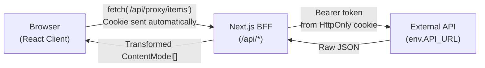
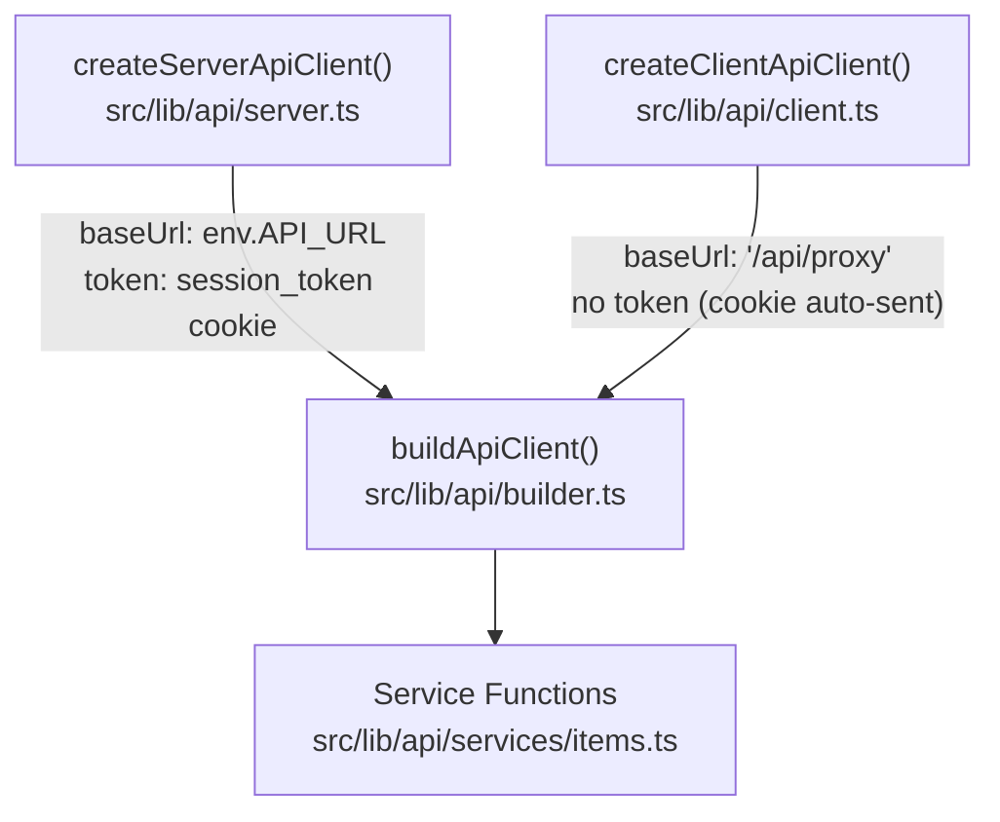
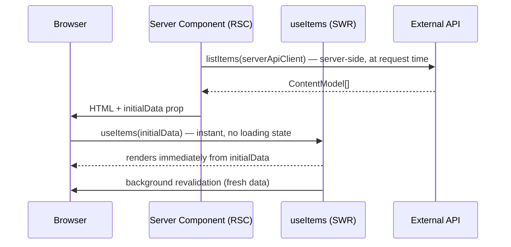
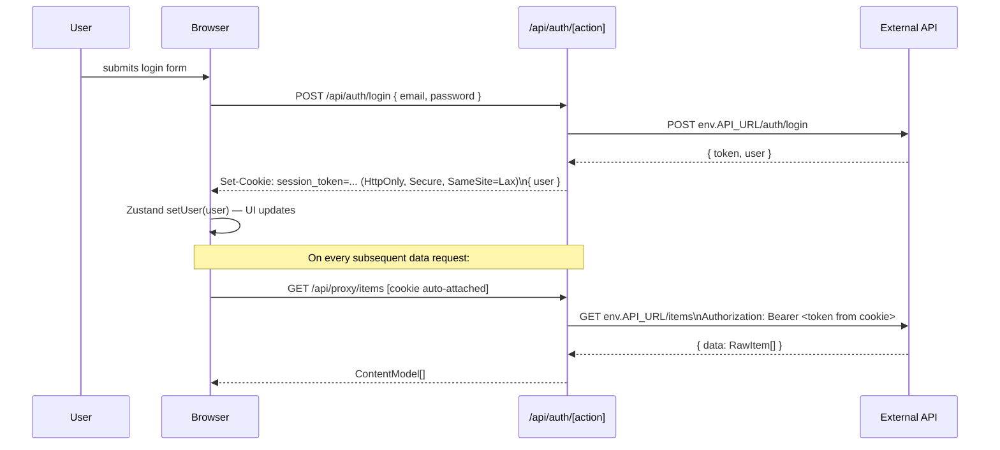
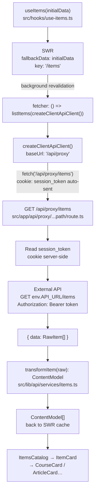

# Onboarding & Developer Guide

Welcome to the team. This guide walks you through everything you need to understand and extend this Next.js 16 starter template with confidence. By the end you'll have shipped your first feature.

---

## Table of Contents

1. [Project Overview](#1-project-overview)
2. [High-Level Architecture](#2-high-level-architecture)
3. [Folder Structure](#3-folder-structure)
4. [Authentication: HttpOnly Cookies Without NextAuth](#4-authentication-httponly-cookies-without-nextauth)
5. [The Data Flow: Request Lifecycle](#5-the-data-flow-request-lifecycle)
6. [Styling & UI Patterns: The Typed Variant System](#6-styling--ui-patterns-the-typed-variant-system)
7. [Your First Ticket: "Add a Promoted Course Shelf"](#7-your-first-ticket-add-a-promoted-course-shelf)
8. [Development Workflow](#8-development-workflow)

---

## 1. Project Overview

**Stack:** Next.js 16 (App Router) · TypeScript strict · Tailwind v4 · SWR · Zustand · React Hook Form · Zod · pnpm

This is a **production-ready** starter — not a tutorial scaffold. Every pattern here exists because it solved a real problem. The three rules everything is measured against: **YAGNI, KISS, DRY**.

### Quick start

```bash
cp .env.example .env.local
# Set API_URL=http://localhost:3001/api (or your backend)

pnpm install
pnpm dev
```

---

## 2. High-Level Architecture

The template is built on three interlocking patterns. Understand these and the rest of the codebase becomes predictable.

### 2.1 BFF (Backend-For-Frontend) Pattern

The Next.js server sits between the browser and your external API. The browser **never** calls the external API directly — all traffic routes through Next.js API routes.



**Why this matters for you:**

- You never write `Authorization: Bearer ...` headers in client components — the BFF handles it.
- The external API URL is never exposed to the browser.
- All authentication state is in an HttpOnly cookie that JavaScript cannot read.

### 2.2 The Dual-Context Fetch Factory

The same service functions (`listItems`, `getItem`) run in **both** Server Components and Client Components. The difference is which `ApiClient` instance you pass them.



**Server context** (`createServerApiClient`): Reads the `session_token` HttpOnly cookie directly and calls the external API at `env.API_URL`. Zero proxy hop. Use in Server Components and Route Handlers.

**Client context** (`createClientApiClient`): Points at `/api/proxy`. The browser's cookie is sent automatically with every same-origin request; the proxy extracts it and adds the Bearer header. Use inside SWR fetchers (`useItems`, `useItem`).

```ts
// ✅ Server Component (RSC)
const api = await createServerApiClient()
const items = await listItems(api) // direct → external API

// ✅ SWR fetcher in a hook (client)
useSWR(key, () => listItems(createClientApiClient())) // → /api/proxy → external API
```

### 2.3 RSC + SWR Hydration (Zero Waterfall)



The Server Component fetches data and passes it as `initialData` to the client component. SWR uses it as `fallbackData` so the page renders immediately — no spinner, no waterfall.

---

## 3. Folder Structure

```
src/
├── app/
│   ├── (main)/                         # Authenticated layout group
│   │   ├── layout.tsx                  # Shell with Header/Footer
│   │   ├── page.tsx                    # Homepage RSC (fetch → pass initialData)
│   │   ├── _components/
│   │   │   └── items-catalog.tsx       # Client component — SWR hydration
│   │   └── [slug]/
│   │       ├── page.tsx                # Detail page RSC
│   │       └── _components/
│   │           └── item-detail.tsx     # Detail client component
│   ├── (auth)/
│   │   └── login/
│   │       └── page.tsx                # Login page (public)
│   └── api/
│       ├── auth/
│       │   └── [action]/route.ts       # BFF auth: login / logout / me
│       └── proxy/
│           └── [...path]/route.ts      # BFF data proxy (SSRF-guarded)
│
├── components/
│   ├── shelf/
│   │   ├── shelf.tsx                   # ← SHELF: variant-driven layout container
│   │   └── shelf-header.tsx            # Title + optional CTA link
│   ├── item/
│   │   ├── item-card.tsx               # ← ITEM DISPATCHER: switches on ContentModel.type
│   │   ├── course-card.tsx             # Renders CourseModel
│   │   ├── article-card.tsx            # Renders ArticleModel
│   │   ├── event-card.tsx              # Renders EventModel
│   │   └── generic-item-card.tsx       # Renders ItemModel fallback
│   ├── ui/                             # Atomic UI (Button, Badge, Card, Input…)
│   ├── layout/                         # Header, Footer, Navigation
│   └── providers/
│       ├── auth-provider.tsx           # Hydrates Zustand from /api/auth/me on mount
│       └── swr-provider.tsx            # SWRConfig root
│
├── hooks/
│   ├── keys.ts                         # Centralized SWR cache keys
│   ├── use-items.ts                    # useItems / useItem SWR hooks
│   └── use-auth.ts                     # useAuth: login, logout, user, isHydrated
│
├── lib/
│   ├── api/
│   │   ├── builder.ts                  # buildApiClient() — shared factory
│   │   ├── client.ts                   # createClientApiClient() — BFF proxy base
│   │   ├── server.ts                   # createServerApiClient() — direct + token
│   │   ├── types.ts                    # ApiClient interface
│   │   └── services/
│   │       └── items.ts                # ← TRANSFORM LAYER: RawItem → ContentModel
│   ├── auth/
│   │   └── constants.ts                # SESSION_COOKIE = 'session_token'
│   └── net/
│       └── net.ts                      # netFetch() with correlation ID headers
│
├── store/
│   ├── auth.store.ts                   # Zustand: user, isHydrated
│   └── ui.store.ts                     # Zustand: UI-only state
│
├── types/
│   ├── content.ts                      # ← CONTENT MODEL: discriminated union + variants
│   └── auth.ts                         # User interface
│
└── config/
    └── env.ts                          # Zod-validated env vars (API_URL)
```

**Key mental model:** Data flows _down_ this chain on every request:

```
types/content.ts (shapes)
  → lib/api/services/items.ts (transform)
    → hooks/use-items.ts (SWR)
      → app/(main)/_components/items-catalog.tsx (render)
        → components/item/item-card.tsx (dispatch by type)
          → components/item/course-card.tsx (display)
```

---

## 4. Authentication: HttpOnly Cookies Without NextAuth

This project does **not** use NextAuth. Authentication is a thin BFF layer.

### The Auth Flow



### Auth Route Handler (`src/app/api/auth/[action]/route.ts`)

Three actions, one file:

| Method | Path               | What it does                                               |
| ------ | ------------------ | ---------------------------------------------------------- |
| `POST` | `/api/auth/login`  | Calls backend, sets HttpOnly cookie                        |
| `POST` | `/api/auth/logout` | Deletes the cookie                                         |
| `GET`  | `/api/auth/me`     | Reads cookie, validates token with backend, returns `User` |

> **Note for your team:** Three TODOs remain in this file — replace the placeholder backend endpoint paths and field names to match your contract before going to production.

### Client-Side State: `useAuth` + `AuthProvider`

The `AuthProvider` (mounted in the root layout) calls `/api/auth/me` once on mount and populates the Zustand store. The `isHydrated` flag prevents auth-flash:

```ts
// src/components/providers/auth-provider.tsx
useEffect(() => {
  fetch('/api/auth/me')
    .then((res) => (res.ok ? res.json() : null))
    .then((data) => {
      if (data?.user) setUser(data.user)
    })
    .catch(() => {})
    .finally(() => {
      setHydrated()
    }) // ← always fires, even on 401
}, [setUser, setHydrated])
```

Wait for `isHydrated` before conditionally rendering auth-dependent UI:

```ts
const { isAuthenticated, isHydrated } = useAuth()

if (!isHydrated) return <Spinner />          // still checking
if (!isAuthenticated) return <LoginPrompt /> // confirmed unauthenticated
return <Dashboard />
```

### Route Protection: `src/proxy.ts`

The Next.js 16 middleware export is `proxy` (not `middleware`). It checks for the cookie and redirects to `/login` on all protected routes:

```ts
export function proxy(request: NextRequest) {
  const token = request.cookies.get(SESSION_COOKIE)
  if (!token) {
    return NextResponse.redirect(new URL('/login', request.url))
  }
  return NextResponse.next()
}
```

---

## 5. The Data Flow: Request Lifecycle

### Full Request Lifecycle (Client-Side Revalidation)



### Key points per layer

**`hooks/use-items.ts`** — the only SWR entry point for item data. It owns the cache key (`KEYS.items.list`) and ensures every revalidation goes through the transform layer:

```ts
export function useItems(initialData?: ContentModel[]) {
  const { data, error, isLoading, mutate } = useSWR<ContentModel[]>(
    KEYS.items.list,
    () => listItems(createClientApiClient()), // ← fetcher calls service, not raw fetch
    { fallbackData: initialData }
  )
  return { items: data ?? [], isLoading, error, mutate }
}
```

**`lib/api/services/items.ts`** — the transform layer. `RawItem` (snake_case, all type-specific fields optional) → `ContentModel` (camelCase, discriminated union). **Never bypass this layer.**

**`app/api/proxy/[...path]/route.ts`** — the SSRF-guarded pass-through. Two security checks before forwarding:

1. Path segments must not contain `..` or `.` (traversal rejection)
2. Assembled URL origin must match `env.API_URL` origin (SSRF guard)

---

## 6. Styling & UI Patterns: The Typed Variant System

### ShelfVariant — Layout Container

`ShelfVariant` is a union type defined in `src/types/content.ts`. The `Shelf` component uses it as a required prop, driving a `Record<ShelfVariant, string>` map of Tailwind classes:

```ts
// src/types/content.ts
export type ShelfVariant = 'horizontal-scroll' | 'grid-2' | 'grid-3' | 'grid-4' | 'hero'
```

```ts
// src/components/shelf/shelf.tsx
const variantClasses: Record<ShelfVariant, string> = {
  'horizontal-scroll': 'flex overflow-x-auto gap-4 snap-x snap-mandatory pb-4',
  'grid-2': 'grid grid-cols-1 sm:grid-cols-2 gap-4',
  'grid-3': 'grid grid-cols-1 sm:grid-cols-2 lg:grid-cols-3 gap-4',
  'grid-4': 'grid grid-cols-1 sm:grid-cols-2 lg:grid-cols-4 gap-4',
  hero: 'grid grid-cols-1',
}
```

Using `Record<ShelfVariant, string>` instead of a plain object gives you a **compile error** if you add a new `ShelfVariant` value but forget to add its Tailwind class.

Usage:

```tsx
<Shelf variant="grid-3" title="All Courses" cta={{ label: 'See all', href: '/courses' }}>
  {items.map((item) => (
    <ItemCard key={item.id} variant="md" data={item} />
  ))}
</Shelf>
```

### ItemVariant — Card Size

```ts
export type ItemVariant = 'sm' | 'md' | 'lg' | 'brick'
```

Each card component (`CourseCard`, `ArticleCard`, etc.) receives `variant: ItemVariant` and renders a different layout. Use `sm` in `horizontal-scroll` shelves, `md`/`lg` in grid shelves, `brick` in list views.

### ItemCard — Type Dispatcher

`ItemCard` is the single entry point for rendering any content. It never renders HTML itself — it switches on `data.type` and delegates to the specific card:

```ts
// src/components/item/item-card.tsx
function renderCard(variant: ItemVariant, data: ContentModel) {
  switch (data.type) {
    case 'course':  return <CourseCard  variant={variant} data={data} />
    case 'article': return <ArticleCard variant={variant} data={data} />
    case 'event':   return <EventCard   variant={variant} data={data} />
    case 'item':    return <GenericItemCard variant={variant} data={data} />
    default: {
      const _exhaustive: never = data
      void _exhaustive
      return null
    }
  }
}
```

The `never` exhaustive check is the enforcement mechanism: **if you add a new `ContentModel` member without adding a case here, TypeScript will refuse to compile.** This is intentional.

---

## 7. Your First Ticket: "Add a Promoted Course Shelf"

> **Goal:** Add a new `promoted-course` content type and a `featured-banner` shelf variant, then render a "Promoted Courses" shelf on the homepage.

Work through this end-to-end. Each step shows exactly which file to edit and why.

---

### Step 1 — Define `PromotedCourseModel` in `src/types/content.ts`

A promoted course extends a regular course with a badge label and a promotion expiry date.

Open `src/types/content.ts` and add the new model + update the union:

```ts
// Add this interface after EventModel
export interface PromotedCourseModel {
  type: 'promoted-course'
  id: string
  title: string
  description: string
  instructor: string
  thumbnailUrl: string
  badge: string // e.g. "Featured", "New", "Staff Pick"
  promotedUntil: string // ISO date string
}

// Update the union
export type ContentModel = CourseModel | ArticleModel | EventModel | ItemModel | PromotedCourseModel // ← add this
```

**What breaks immediately (intentionally):** TypeScript will now error in `src/components/item/item-card.tsx` because the `default: never` branch is now reachable with `data.type === 'promoted-course'`. That's the compile-time enforcement working exactly as designed.

---

### Step 2 — Update the Transform Layer in `src/lib/api/services/items.ts`

Add `'promoted-course'` to `RawItem.type`, add its optional fields, and handle it in the `switch`:

```ts
// Update RawItem — add the new type discriminant and optional fields
interface RawItem {
  id: string
  type: 'course' | 'article' | 'event' | 'item' | 'promoted-course'  // ← add
  title: string
  description: string
  thumbnail_url: string
  // ItemModel
  created_at?: string
  // CourseModel / PromotedCourseModel
  instructor?: string
  // ArticleModel
  author?: string
  published_at?: string
  // EventModel
  starts_at?: string
  location?: string
  // PromotedCourseModel
  badge?: string           // ← add
  promoted_until?: string  // ← add
}

// Add the case in transformItem's switch
case 'promoted-course':
  return {
    ...base,
    type: 'promoted-course',
    instructor: raw.instructor ?? '',
    badge: raw.badge ?? 'Featured',
    promotedUntil: raw.promoted_until ?? '',
  }
```

Run `pnpm typecheck` — the `items.ts` error is now gone. The `item-card.tsx` error still exists because you haven't created the card component yet.

---

### Step 3 — Add the `featured-banner` Shelf Variant

**3a.** Add the variant to the type union in `src/types/content.ts`:

```ts
export type ShelfVariant =
  | 'horizontal-scroll'
  | 'grid-2'
  | 'grid-3'
  | 'grid-4'
  | 'hero'
  | 'featured-banner' // ← add
```

**3b.** Add its Tailwind class to the `Record` in `src/components/shelf/shelf.tsx`:

```ts
const variantClasses: Record<ShelfVariant, string> = {
  'horizontal-scroll': 'flex overflow-x-auto gap-4 snap-x snap-mandatory pb-4',
  'grid-2': 'grid grid-cols-1 sm:grid-cols-2 gap-4',
  'grid-3': 'grid grid-cols-1 sm:grid-cols-2 lg:grid-cols-3 gap-4',
  'grid-4': 'grid grid-cols-1 sm:grid-cols-2 lg:grid-cols-4 gap-4',
  hero: 'grid grid-cols-1',
  'featured-banner': 'grid grid-cols-1 lg:grid-cols-2 gap-6', // ← add
}
```

**3c.** Create the promoted course card at `src/components/item/promoted-course-card.tsx`:

```tsx
import type { PromotedCourseModel, ItemVariant } from '@/types/content'
import { Card, CardContent, CardHeader } from '@/components/ui/card'
import { Badge } from '@/components/ui/badge'
import Image from 'next/image'

interface PromotedCourseCardProps {
  variant: ItemVariant
  data: PromotedCourseModel
}

export function PromotedCourseCard({ variant, data }: PromotedCourseCardProps) {
  return (
    <Card className="overflow-hidden border-2 border-primary">
      <div className="aspect-video relative bg-muted">
        {data.thumbnailUrl && (
          <Image src={data.thumbnailUrl} alt={data.title} fill className="object-cover" />
        )}
      </div>
      <CardHeader className="p-4">
        <div className="flex items-center gap-2 mb-1">
          <Badge variant="default">{data.badge}</Badge>
          {data.promotedUntil && (
            <span className="text-xs text-muted-foreground">
              Until {new Date(data.promotedUntil).toLocaleDateString()}
            </span>
          )}
        </div>
        <p className="font-semibold line-clamp-2">{data.title}</p>
        <p className="text-sm text-muted-foreground">{data.instructor}</p>
        {variant === 'lg' && (
          <p className="text-sm text-muted-foreground line-clamp-2">{data.description}</p>
        )}
      </CardHeader>
    </Card>
  )
}
```

**3d.** Register it in the `ItemCard` dispatcher (`src/components/item/item-card.tsx`):

```ts
import { PromotedCourseCard } from './promoted-course-card'  // ← add import

function renderCard(variant: ItemVariant, data: ContentModel) {
  switch (data.type) {
    case 'course':          return <CourseCard variant={variant} data={data} />
    case 'article':         return <ArticleCard variant={variant} data={data} />
    case 'event':           return <EventCard variant={variant} data={data} />
    case 'item':            return <GenericItemCard variant={variant} data={data} />
    case 'promoted-course': return <PromotedCourseCard variant={variant} data={data} />  // ← add
    default: {
      const _exhaustive: never = data
      void _exhaustive
      return null
    }
  }
}
```

Run `pnpm typecheck` — zero errors.

---

### Step 4 — Fetch and Display on the Homepage

**4a.** Add a new SWR cache key for promoted courses in `src/hooks/keys.ts`:

```ts
export const KEYS = {
  items: {
    list: '/items',
    detail: (id: string) => `/items/${id}`,
  },
  promotedCourses: {
    list: '/items/promoted', // ← add (adjust to match your backend endpoint)
  },
} as const
```

**4b.** Add a service function for promoted courses in `src/lib/api/services/items.ts`:

```ts
export async function listPromotedCourses(api: ApiClient): Promise<ContentModel[]> {
  const data = await api.get<{ data: RawItem[] }>('/items/promoted')
  return data.data.map(transformItem)
}
```

**4c.** Add a `usePromotedCourses` hook in `src/hooks/use-items.ts`:

```ts
import { listItems, getItem, listPromotedCourses } from '@/lib/api/services/items'

export function usePromotedCourses(initialData?: ContentModel[]) {
  const { data, error, isLoading, mutate } = useSWR<ContentModel[]>(
    KEYS.promotedCourses.list,
    () => listPromotedCourses(createClientApiClient()),
    { fallbackData: initialData }
  )
  return { items: data ?? [], isLoading, error, mutate }
}
```

**4d.** Update the homepage RSC (`src/app/(main)/page.tsx`) to fetch both datasets server-side:

```ts
import { createServerApiClient } from '@/lib/api/server'
import { listItems, listPromotedCourses } from '@/lib/api/services/items'
import { ItemsCatalog } from './_components/items-catalog'
import { PromotedCoursesCatalog } from './_components/promoted-courses-catalog'
import type { ContentModel } from '@/types/content'

export default async function HomePage() {
  const api = await createServerApiClient()

  let items: ContentModel[] = []
  let promotedCourses: ContentModel[] = []

  try {
    ;[items, promotedCourses] = await Promise.all([
      listItems(api),
      listPromotedCourses(api),
    ])
  } catch {
    // API unavailable — SWR retries on client
  }

  return (
    <div className="space-y-8">
      <h1 className="text-3xl font-bold">Home</h1>
      <PromotedCoursesCatalog initialData={promotedCourses} />
      <ItemsCatalog initialData={items} />
    </div>
  )
}
```

**4e.** Create the client component `src/app/(main)/_components/promoted-courses-catalog.tsx`:

```tsx
'use client'

import { usePromotedCourses } from '@/hooks/use-items'
import { Shelf } from '@/components/shelf'
import { ItemCard } from '@/components/item'
import type { ContentModel } from '@/types/content'

interface PromotedCoursesCatalogProps {
  initialData: ContentModel[]
}

export function PromotedCoursesCatalog({ initialData }: PromotedCoursesCatalogProps) {
  const { items, isLoading } = usePromotedCourses(initialData)

  if (isLoading && items.length === 0) return null

  if (items.length === 0) return null // don't render empty shelf

  return (
    <Shelf variant="featured-banner" title="Promoted Courses">
      {items.map((item) => (
        <ItemCard key={item.id} variant="lg" data={item} />
      ))}
    </Shelf>
  )
}
```

**Final check:**

```bash
pnpm typecheck   # 0 errors
pnpm lint        # 0 warnings
pnpm build       # should compile clean
```

You've added a new content type, wired it through the entire transform → cache → render pipeline, and shipped a new shelf variant — all type-safe, with zero changes to the auth or proxy infrastructure.

---

## 8. Development Workflow

### Commands

| Command          | What it does                                   |
| ---------------- | ---------------------------------------------- |
| `pnpm dev`       | Start dev server at `localhost:3000`           |
| `pnpm typecheck` | TypeScript strict check (no emit)              |
| `pnpm lint`      | ESLint across `src/`                           |
| `pnpm lint:fix`  | ESLint with auto-fix                           |
| `pnpm format`    | Prettier format                                |
| `pnpm build`     | Production build (catches all TS + SSR errors) |

### Conventions to follow

- **File names:** kebab-case, descriptive enough to understand purpose from the name alone
- **File size:** keep files under 200 lines — split by responsibility, not by arbitrary line count
- **Service layer is the only transform point:** never call `fetch` directly in a hook or component. Always go through a service function that returns a `ContentModel`.
- **SWR keys live in `hooks/keys.ts`:** never inline a string key in `useSWR`. Centralised keys prevent cache fragmentation.
- **`createClientApiClient()` in hooks, `createServerApiClient()` in RSC/Route Handlers:** never swap them.
- **Exhaustive switches everywhere:** TypeScript's `never` check is your safety net. Don't suppress it.

### Adding a new content type (checklist)

- [ ] Add `XxxModel` interface to `src/types/content.ts`
- [ ] Add to `ContentModel` union
- [ ] Add optional fields to `RawItem` in `src/lib/api/services/items.ts`
- [ ] Add case to `transformItem` switch
- [ ] Create `src/components/item/xxx-card.tsx`
- [ ] Add case to `renderCard` in `src/components/item/item-card.tsx`
- [ ] Add SWR key to `src/hooks/keys.ts` if a separate endpoint exists
- [ ] Add service function if separate endpoint exists
- [ ] Add `useXxx` hook if needed
- [ ] Run `pnpm typecheck` — zero errors confirms the union is fully handled

### Adding a new shelf variant (checklist)

- [ ] Add to `ShelfVariant` union in `src/types/content.ts`
- [ ] Add Tailwind class to `variantClasses` in `src/components/shelf/shelf.tsx`
- [ ] Run `pnpm typecheck` — the `Record<ShelfVariant, string>` enforces completeness

---

_Questions? Read `docs/system-architecture.md` for the full architecture reference, `docs/code-standards.md` for formatting and conventions, and `docs/codebase-summary.md` for a component inventory._
